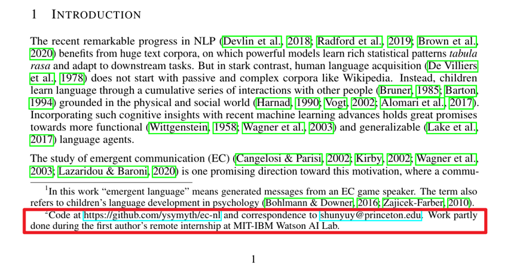
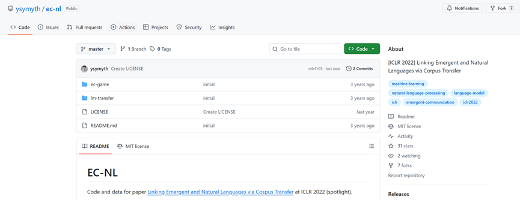
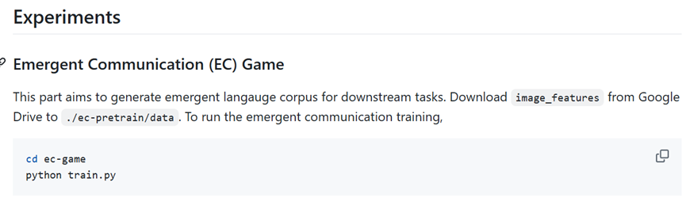
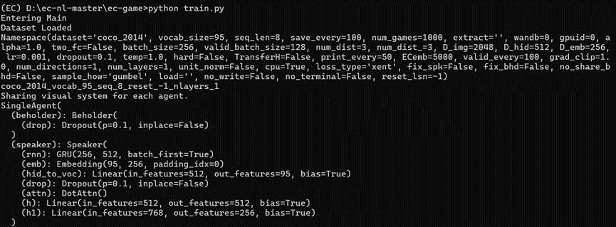

# Paper Reproduction

Reproducing others' work is an important step in scientific research, with the following main purposes:

- **Finding new ideas:** Scientific research is rarely built from scratch; 90% of research work is based on optimizing existing work. For beginners, it is very difficult to identify the shortcomings of a solution just by reading papers. At this point, reproducing others' work becomes crucial. During reproduction, you can analyze the solution's shortcomings in terms of efficiency, robustness, problem modeling, and deployment feasibility, which may inspire your own ideas.

- **Reproduction is also part of learning:** For research beginners, reproducing others' work is an excellent learning opportunity. In this process, you will encounter issues such as environment setup, data processing, library dependency conflicts, and gradually understand the correspondence between code and paper content. The earlier you encounter and solve these problems, the better prepared you will be for future work.

- **Using the method as a baseline for comparison:** This is usually part of the experimental section of a paper. Since you need to do it anyway, why not start early?

Understanding the importance of paper reproduction, let's illustrate how to reproduce a paper's solution with an example.

## Finding the Code

Note that not all papers make their code public. Generally, only those confident in their work, or from top research/enterprise units (like Microsoft, top university labs), will choose to release code. Most papers do not release code (after all, who wants their work to be scrutinized again?), making reproduction more difficult. In such cases, you need to understand the solution from the paper and write the code yourself (you can also email the authors to request code, but the success rate is usually low). Here, we only introduce the former.

Open-source work usually provides a GitHub link in the paper, often found in the abstract, footnotes, evaluation section, or appendix. For example, in "Linking Emergent and Natural Languages via Corpus Transfer," the code link is in a footnote on the first page.

Visit the link to access the corresponding GitHub page.

Before reproducing the code, the most important thing is to read the description in the README file provided by the author. The structure of README files varies between projects. A good README should quickly inform readers about environment dependencies, main entry points, hyperparameter settings, and run commands. This README will support your entire reproduction process and is very important.

Download the project's code. Now, you have completed the first step of code reproduction.

## Preparation

Preparation mainly includes downloading datasets and setting up the runtime environment.

Starting with datasets: generally, papers use public datasets (COCO, CIFAR-10, MNIST, etc.) or data collected by the authors from simulators or real environments. Due to the large size (often hundreds of MB or even GB), these files are not included in the GitHub repository. You need to download them from relevant websites. Common data hosting platforms include:

- [Hugging Face](https://huggingface.co/): A leading open-source machine learning platform, providing many models and datasets. Many excellent models are released here.
- [Zenodo](https://zenodo.org/): An open-access data storage platform for papers, datasets, technical reports, etc., supporting unique persistent identifiers (DOI) for each upload for public sharing.

For example, in "Linking Emergent and Natural Languages via Corpus Transfer," the dataset source is specified in the code repository's README, and the dataset is hosted on Google Drive.

Download the corresponding files from Google Drive to complete the dataset preparation.

Note: You need to place the dataset in the correct directory to ensure the program can read it properly. This requires reading the README and code to find the correct location. For example, in "Linking Emergent and Natural Languages via Corpus Transfer," you can find the dataset directory in the main function train.py.

Therefore, place the downloaded dataset files in the data folder in the current directory.

Some projects also provide pre-trained model parameters. The configuration process is the same as for datasets; please follow the README instructions.

For environment setup, it is recommended to use conda, which allows you to create independent Python virtual environments for each project, making dependency management easier. For installation and usage, refer to the [Anaconda Runoob Tutorial](https://www.runoob.com/python-qt/anaconda-tutorial.html). It is recommended to use [miniforge](https://github.com/conda-forge/miniforge). The differences can be further discussed in the experiment section.

After creating and activating the conda environment, install the project dependencies. Usually, the author provides a requirements.txt file in the repository. Use pip install -r requirements.txt in the virtual environment to install all dependencies. In "Linking Emergent and Natural Languages via Corpus Transfer," the author does not provide this file but lists the dependencies explicitly in the README, so you need to install them one by one manually.

> For those interested, you can also learn about the uv tool.

## Running the Code

Find the main entry point of the project and execute the corresponding command. For example, in "Linking Emergent and Natural Languages via Corpus Transfer," the author provides the following run command:

Follow the instructions and run python train.py in the corresponding directory (or run it directly in an IDE). If there are no error messages and the script runs normally, you are good to go.

Note: The above is just a simple example. Because the code is well maintained, the entire reproduction process, including dataset preparation and code execution, went smoothly. Remember, the difficulty of reproducing a work depends entirely on the author's project maintenance. Missing files or a poorly written README can greatly affect your experience. Additionally, you may encounter unexpected issues such as dependency conflicts or hardware configuration differences (e.g., running neural networks on CPU vs. GPU), which may cause errors and require troubleshooting. For troubleshooting, you can refer to the following:

- Check the project's GitHub issues: Issues provide a communication channel for developers and users. Here, you can see other users' bug reports and compare with your environment. For using issues, see [GitHub Issues Quickstart](https://docs.github.com/zh/issues/tracking-your-work-with-issues/learning-about-issues/quickstart)
- Various forums: For function errors or library conflicts, you can search on forums like CSDN or Stack Overflow.
- Large language models: LLMs are now very capable at debugging. However, their effectiveness depends on context. When using them for debugging, don't just paste the error message; try to describe your problem clearly, including the function, library, version, and dependencies involved.

Most of the time, reproducing others' work is a painful and challenging process, and sometimes you may find that the results do not match those claimed in the paper (very common in AI). Therefore, prioritize reproducing work that is more likely to succeed. This may sound vague, but in my experience, projects with the following characteristics are more likely to be successfully reproduced:

- From top research institutions, such as Microsoft or DeepMind
- From top labs or well-known researchers in a specific field (requires some understanding of the research community)
- High number of GitHub stars/forks

Note that reproduction is not just about repeating others' work; understanding the code is also important. You should focus on the code corresponding to the core methods of the paper and clarify how the innovations are implemented. Modules like parameter initialization or data import/export can be skimmed over.

Finally, keep your own notes or work records during reproduction, mainly to document problems and solutions, to avoid having to start over when migrating later. Recommended note-taking tools: Notion, Yuque.

## Reference Links

[PaddleEdu/paper-reproduction-tutorials](https://github.com/PaddleEdu/paper-reproduction-tutorials): Excellent GitHub tutorials on paper reproduction, including practical cases for multiple AI projects.

[DengBoCong/nlp-paper](https://github.com/DengBoCong/nlp-paper): Excellent NLP paper reproduction projects on GitHub, including paper links and reading notes.

[Anaconda Runoob Tutorial](https://www.runoob.com/python-qt/anaconda-tutorial.html): Tutorial for conda installation and basic commands, suitable for research beginners.

[Hugging Face](https://huggingface.co/): The go-to open-source platform in AI, recognized by top companies and research institutions worldwide.

[Zenodo](https://zenodo.org/): Research data hosting platform covering a wide range of fields. No matter how niche your research area is, you may find relevant datasets here.

[GitHub Issues Quickstart](https://docs.github.com/zh/issues/tracking-your-work-with-issues/learning-about-issues/quickstart): Quick guide to getting started with GitHub issues.