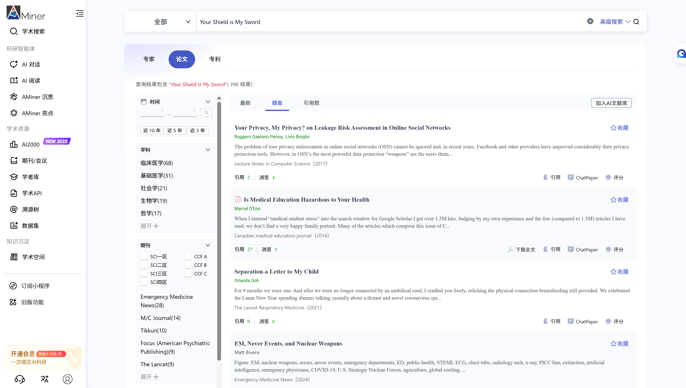
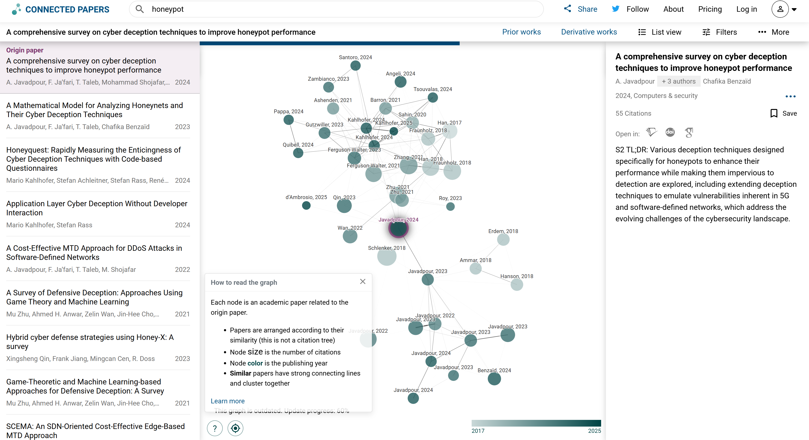
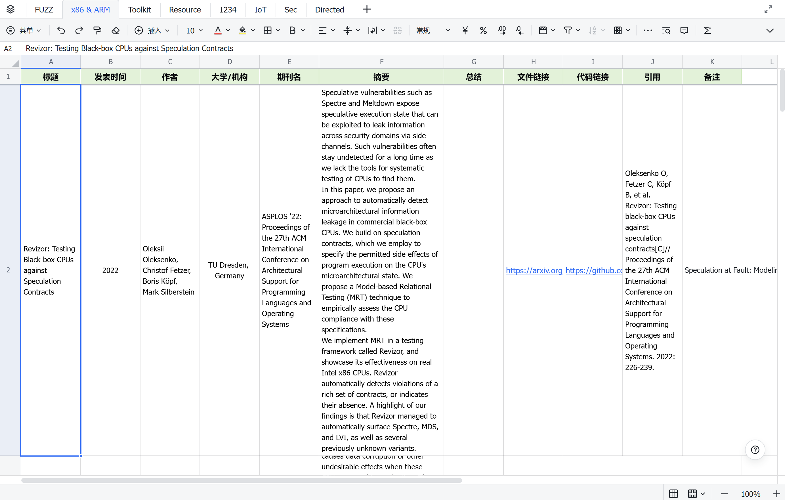
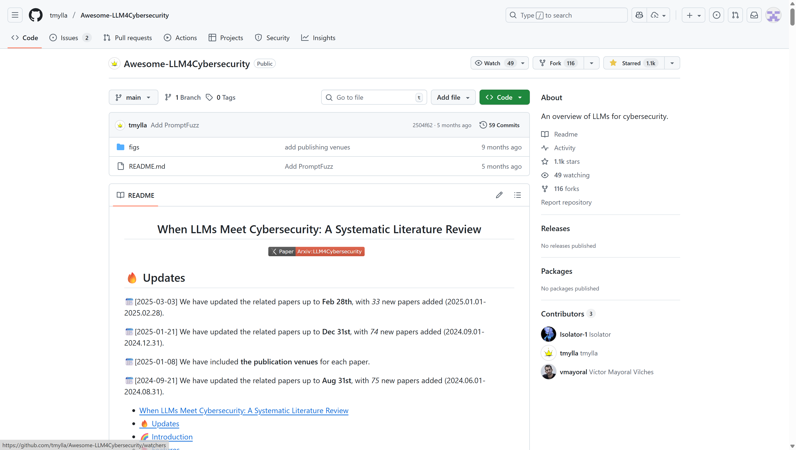
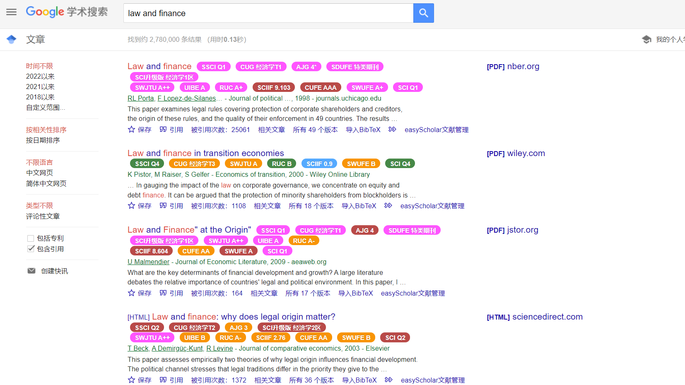

# 文献调研

首先需要明确的是文献调研的目的，通常来说文献调研往往是为了建立对研究领域的基础认识，包括目标研究领域中的研究问题、研究方法、研究热点、研究趋势，并进一步确定自己的研究方向，从而为论文阅读及后续工作奠定基础。如果说硕博是希望培养出"你就是这个领域的专家"，那么掌握文献调研并实践能让你"看起来是这个领域的专家"。

文献调研工作可大致分为三部分：找论文、整理论文、追踪学术进展。

## 找论文

在找论文的第一阶段里，通常大部分人并没有一个确定的研究方向，只是跟着实验室的研究领域进一步探索，因此需要尽快建立对该研究领域的基础认识。此时我们可以优先搜索综述类论文和部分优秀的博士学位论文，这些论文的信息密度相对更高，通常会将该领域进一步细分。综述的关键词包括survey, review等。

在阅读的过程中我们不仅要了解这个领域的优秀成果，还要感受研究的发展趋势、当前各种研究方法的优缺点等，将这些内容整理为笔记也是不错的选择，建议重点记录该领域的关键论文，此外我们还可以着重记录某些关键词，用作后续文献检索使用。

找论文的第二阶段则是对某个或某几个细分的研究方向做进一步分析，使用多个关键词进行论文检索，收集相关度较高的优秀论文，以便后续进行精读。

注：如果实验室中有相同研究领域的师兄师姐，可以请他们直接推荐相应的综述和关键论文，甚至成熟的实验室中可能已经建立了自己的文献库，勇敢地和他们进行交流同样也是学术生活的重要一环。

常用的文献检索工具包括：

- [谷歌学术](https://scholar.google.com/)：你所需要的论文、书籍、预印本、专利（英文）等基本都可以在谷歌学术找到，但要注意的是，谷歌学术本身并不提供论文的访问权限，它只负责检索并提供相应的访问地址，有时你可以在论文的多个版本中找到一个可以免费访问的PDF地址。谷歌学术常用的搜索技巧如下：

  - 直接检索关键词：包括标题、ISBN/ISSN、DOI等都可以作为检索的关键词，空格相当于"AND"（同时满足多个关键词）

  - \"\"引号是要求使用完整字符串搜索

  - 高级检索：除了记住常用的谷歌学术语法之外，还可以直接使用谷歌学术自带的高级搜索功能，特别注意的是，其实谷歌学术的高级搜索中支持根据期刊/会议名字来检索论文，如图所示：

- [Amier](https://www.aminer.cn/)：Aminer最大的优势是更加符合国人的操作习惯，并且提供了期刊/会议分区筛选的功能，以及诸多文献追踪的相关功能，缺点是论文库索引没有谷歌学术那么全，体验下来觉得好用的功能：

  - 关键词订阅/学者订阅/期刊订阅从而追踪最新论文：

- 适合小白的期刊筛选功能

- [wispaper](https://www.wispaper.ai/)：基于大模型的AI检索，试用了一下，作为辅助工具还是可以的。

- [知网](https://www.cnki.net/)："知网是个什么东西"，搜索国内硕博论文和专利比较好用。

- [connectedpapers](https://www.connectedpapers.com/)：可视化观察论文关联性，可以根据一篇论文快速找到该领域的相关论文。

- SCIHub：有时由于版权问题，想要查看的论文无法下载，就可以复制DIO号，在SCIHub中尝试寻找免费的PDF，网址可能是变化的，需要用谷歌搜索最新网址。

## 整理论文

文献调研工作的三部分是深度耦合的，整理论文则是将找到的高相关论文或综述保存到自己的文献库中，要保存的信息包括不限于：论文题目、论文年限、论文PDF地址、开源代码地址等。在建立自己的文献库时，最好有针对性的对论文进行一句话总结，以便后续翻看文献库时能够有一个快速回忆的锚点。文献管理的工具方面，除了大家都在安利的Zotero之外，我还选择了一种更加朴素的方法——表格。

- Zotero的浏览器插件可以帮助我们快速导入文献到本地中，解析可以得到论文的大多数信息，也可以作为文献阅读的工具。

- 我还选择了在线表格作为文献整理的工具，原因无他，直观方便，我使用的飞书的智能表格，列包括：论文标题、发表时间、作者、大学/机构、会议/期刊名、会议/期刊等级、摘要、总结、PDF、代码链接；分sheet记录不同方向的论文信息、开源工具信息、在线资源等。

## 追踪学术进展

"独学而无友，则孤陋而寡闻"，学术生活中我们还需要追踪最新的学术进展，追踪学术的常用方法包括：

- 推特（x）：很多研究员会在社交媒体上分享最新的学术成果，多关注多点赞一些相关领域的大佬，就会不断刷到相关的内容；

- Arxiv：很多人在投稿前会将论文PDF以预印本的形式上传，作为一个开放获取的数字系统网站，其中包含了诸多学科领域的最新研究（也导致鱼龙混杂），大量计算机学科相关的成果在网站上发布，目前AI相关的论文上传频率是最高的。推荐[MyArxiv](https://github.com/MLNLP-World/MyArxiv)项目，每日更新的情况下，每天上自己的网站瞄一眼，就能跟踪自己感兴趣的分类下的最新论文；也有Arxiv加大模型感知推荐的工具[zotero-arxiv-daily](https://github.com/TideDra/zotero-arxiv-daily)

- 学术会议及论文放榜：时常关注最新的学术会议/期刊的放榜情况，对于自己方向的顶刊/顶会，要及时跟进，阅读最新学术成果；

- [GitHub](https://github.com/)：关注一些学术实验室or对应方向的学术大佬，可以看到他们收藏或开源仓库的动态，此外使用\"awesome\"关键词也可以搜到论文收集的仓库，比如：

- [Hugging Face](https://huggingface.co/papers/trending)：Papers with Code下线后，Hugging Face上线了Trending Papers板块，主要是 AI 领域方面的论文；

- [reseaech gate](https://www.researchgate.net/)：设定有点像科研社交软件，但是并没有那么好用，关注用户后会看到他的论文动态；

- [Amier](https://www.aminer.cn/)：如前所所述，可以订阅关键词、学者、期刊、机构；

- [谷歌数据集搜索引擎](https://datasetsearch.research.google.com>)：字面意思；

- RSS：某些个人博客页面支持RSS的话，可以追踪其最新推文，推荐RSSHub插件，阅读器随意。

- [谷歌学术](https://scholar.google.com/)：谷歌学术还提供了邮件推送功能，可以在关注某些作者后设置接收邮箱；也可以创建快讯以关注某些搜索结果的最新论文情况，同样是推送到邮箱。值得一提的是，在 Gemini 3 Pro 发布之后，谷歌学术也迎来了学术实验室和论文推送功能。

- 知乎/微信公众号等国内平台：适合摸鱼科研，顺便看看计算机各行业的新发展。

计算机会议/期刊分类说明：

计算机领域提及较多的是CCF推荐列表、中科院分区；此外可能还会有各领域的"顶会顶刊"概念，比如网络安全领域的四大顶会：CCS（ACM Conference on Computer and Communications Security）、NDSS（Network and Distributed System Security Symposium）、 S&P（IEEE Symposium on Security and Privacy）和USENIX Security（USENIX Security Symposium）。

- CCF：中国计算机学会发布，将计算机领域的期刊和会议分为A、B、C三个等级；

- JCR：科睿唯安发布，通过分析期刊的引用数据对学术期刊进行系统性评估和排名，分为了四个区；

- 中科院分区：中国科学院文献情报中心发布，部分名单存在争议，分为了四个区。

注：SCI (Science Citation Index)
是由美国科学信息研究所（ISI）创建的文献检索数据库。"分区"指的是对 SCI 期刊按照其影响因子（Impact Factor, IF）进行的等级划分，目的是更精细地评价期刊的学术影响力。

推荐的一些小工具：

- [CCFDDL](https://ccfddl.com/)：查看CCF期刊的截稿时间（有小程序）和[国内版](https://ccfddl.cn/)；

- [会伴](https://www.myhuiban.com/)：可以搜索论文等级、查看截稿时间等；

- [call4paper](https://www.call4papers.cn/ccf/ccf-1.html)：可以搜索论文等级（CCF为主）、查看截稿时间等（有公众号和小程序）。

工具推荐：

- easyScholar：谷歌插件，安装后可以在搜索结果中看到论文会议的等级，缺点是CCF数据集不免费

- [CCFrank](https://github.com/WenyanLiu/CCFrank4dblp)：开源谷歌插件
- [ExCITATION journal ranking in Google Scholar](https://chromewebstore.google.com/detail/excitation-journal-rankin/aolbomhlimkdakklifkocohcgpmojdia)：可查看JCR分区的谷歌插件

注：除了传统的长论文（Full Paper），学术会议还广泛接受多种其他形式的成果发表，包括：short paper（短论文）、demo paper（演示论文）、technical brief（技术简报）、position paper（观点性论文），以及在附属研讨会（workshop）中发表的论文和以海报（poster）形式展示的研究摘要，其他形式的认可度一般低于常规会议。
