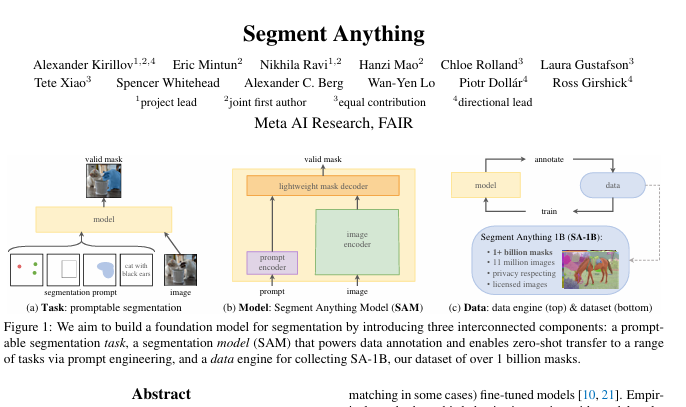
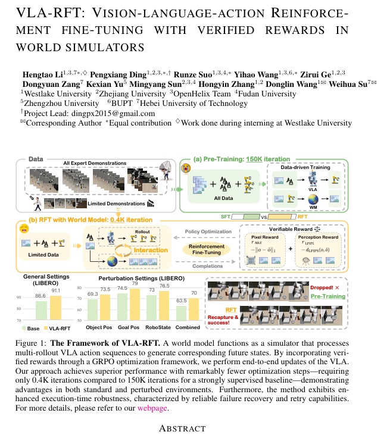
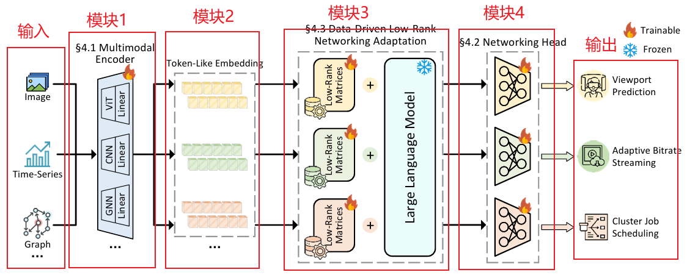
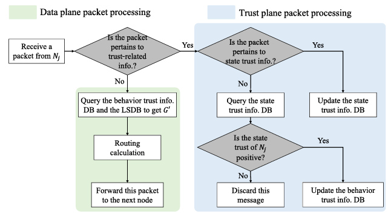

# 论文绘图

绘图是论文工作的重要组成部分之一，也是极其耗费精力的一环。相比于大段大段文本，一张清晰、准确的图片往往能够更快地传达关键信息。想象一下你是论文审稿人，面对洋洋洒洒十几页的论文，最能吸引你眼球、让你快速了解论文核心工作的，往往就是几张图片。近些年的论文写作风格趋势也是如此，在第一页最显眼的地方给出论文工作的核心创新点或者实验结论的图片，以达到瞬间吸引审稿人和读者的目的，例如：

一般来说，一篇论文中的图片可以分为两类：用于解释方案设计及核心创新点的架构/流程图，以及用于展示性能对比的实验结果图。依据这一分类，我将简要介绍不同图片在绘制时的注意要点。

## 架构/流程图

架构/流程图一般出现在论文的方法论章节中，用于解释方案的设计，并突出核心创新点。这一类图片的绘制没有特定的范式，需要你根据你所研究领域的论文绘图风格以及所设计方案的具体流程来灵活调整。

- 流程图：流程图关注方案中数据的走向，以数据的流通过串联起整个方案的 workflow，例如：

- 架构图：架构图关注方案中各个模块之间的协作关系，例如：

需要注意的是，流程图和架构图之间并没有明显的界限，有些图片甚至会将二者结合在一起。无论是上述哪一种类型，在绘制时，都需要遵循以下要点：

- 层次清晰：将系统分为输入、处理、输出等逻辑层次，避免信息堆叠，例如，神经网络图从左到右展示信息流，模块有清晰边界（参照流程图1）。

- 逻辑主线突出：主路径应一眼可见，次要细节可用灰色或虚线（参照架构图1、2）。

- 模块粒度适中：不要在架构图中塞下全部细节，图中只标出关键组件，组件内部的细节可以在对应章节内再添加图片说明（参照流程图1）。

- 文字精炼：模块名简短，避免一大段描述。

- 空间有序：各模块留有合理间距，避免挤成一团，或某一区域存在大量留白。

工具推荐：PPT（组件齐全、功能强大，可以胜任大多数情况下的架构/流程图绘图需求）、Visio（实验室大老板最爱，一般是参与国自然基金申报时使用，图片可以直接以元素的形式嵌入word文档，不过许多设计比较反人类，个人体验下来感觉不如PPT）、其他在线工具（processOn、VisionOn等，内置了一些模板，不过一般需要付费使用）

资料及教程推荐：[拒绝复杂软件！全论文科研模型图我都用PPT画出来！\_哔哩哔哩_bilibili](https://www.bilibili.com/video/BV18qnizxEo1/)

此外，小红书也是一个很好的软件，多给科研类的帖子点点红心，后续也会给你推荐到一些有用的东西。

比如，小红书上的框架图素材整理合集：[论文框架图及配色](https://www.xiaohongshu.com/collection/item/67d780b00163000000000001?xhsshare=WeixinSession&appuid=618b03f7000000000202309a&apptime=1761655907&share_id=bb403df5ad954a4c809f50a832b8ae62&share_channel=wechat)

最后案例下 Gemini 的 Banana 功能，绘图效果很不错，但是提示词需要自己调整，一般可以拿 Banana 找一找画图的思路和布局，然后 PPT 手动绘制

## 实验结果图

在AI或者说是LLM时代，善于利用LLM。并且多阅读顶会论文，发现并"学习"其中制作优秀的图表。

- 表格：把想"学习"的表格排版给截图发送给LLM，直接生成Latex代码，基本上80-90%都可以复现，剩下还需要一些手动调整。

- 图片：同样，利用取色工具，来"学习"优秀图片的配色方案。

好的论文配色也会使图片更加美观，在阅读论文过程中，看到协调美观的配色也可以通过取色工具来收集学习。下面是一些配色网站：

- [Color Hunt - Color Palettes for Designers and Artists](https://colorhunt.co/)

- [Palettes \| Flat UI Colors 🎨 280 handpicked colors ready for COPY & PASTE](https://flatuicolors.com/)

图表生成模板：通常情况下，Python 的 Matplotlib 库已经能够覆盖大部分的绘图需求

Matplotlib图表模板库：[Matplotlib 3.10.7
documentation](https://matplotlib.org/stable/gallery/index)

同样小红书上也有人整理和汇总顶会顶刊上的图表模板合集：

- [数据分析图及配色](https://www.xiaohongshu.com/collection/item/6770d6ba00fb000000000001?xhsshare=WeixinSession&appuid=618b03f7000000000202309a&apptime=1761655895&share_id=48d348f6803345838735c1bd372e02c5&share_channel=wechat)

- [科研素材积累之实验表格](https://www.xiaohongshu.com/collection/item/68bae7d30165000000000001?xhsshare=WeixinSession&appuid=618b03f7000000000202309a&apptime=1761474326&share_id=c80ff5064c5a40a191985a14fcafaab7&share_channel=wechat)
